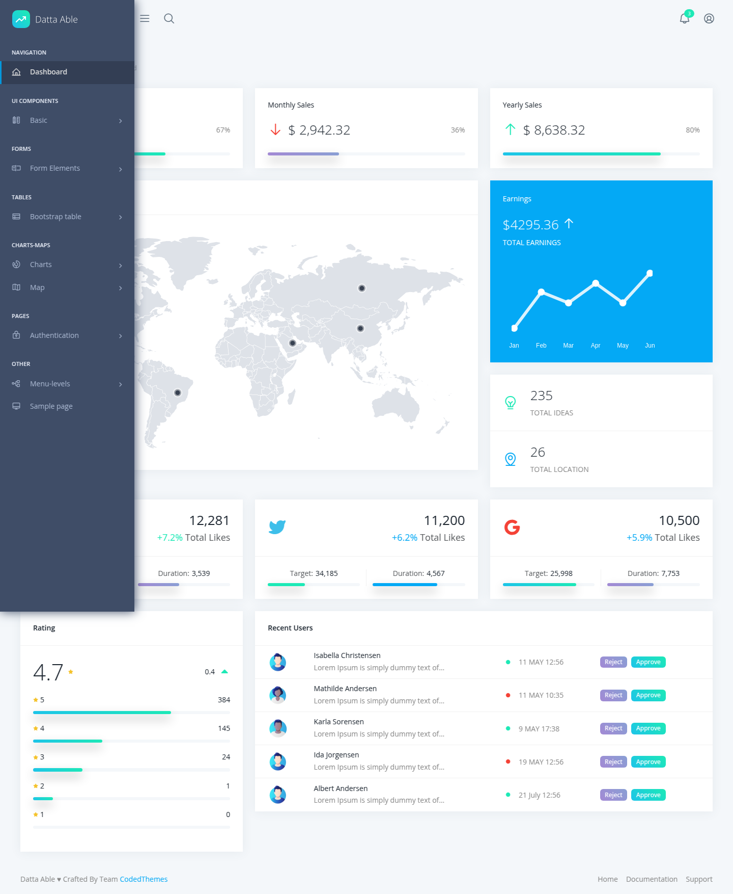
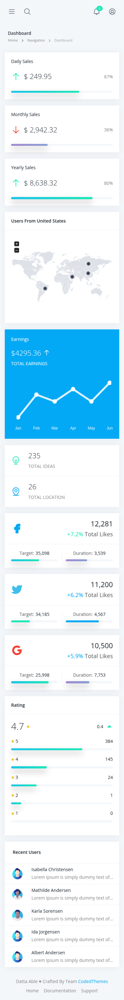
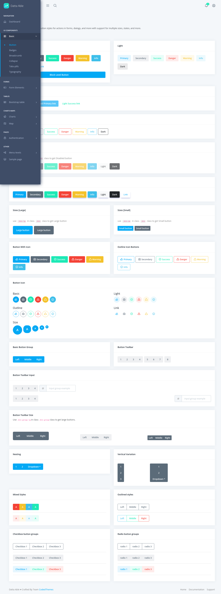
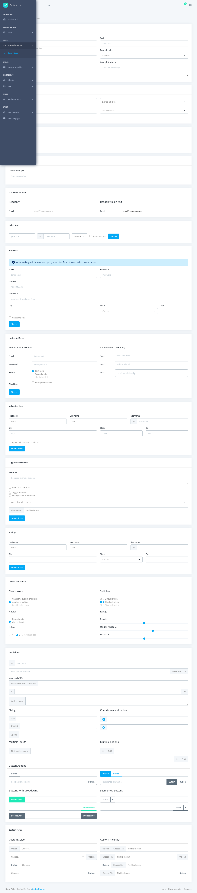
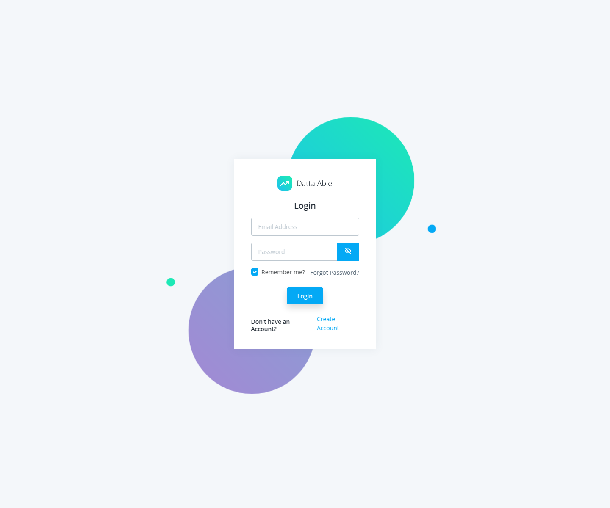
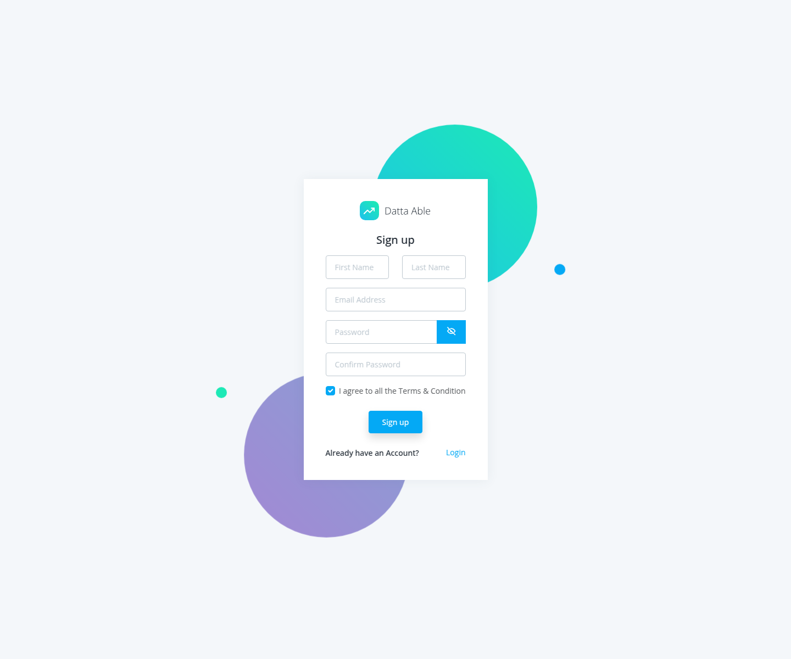

# Template Documentation

This project is a customized working copy of the Datta Able free React admin template. The documentation in this folder is written for agentic development: it explains how the UI system is built, which primitives already exist, and how future work should extend the template without breaking its visual language.

## Start Here

- [style-guide.md](./style-guide.md): visual identity, design tokens, layout rules, and composition patterns
- [component-library.md](./component-library.md): route-by-route and file-by-file inventory of reusable UI pieces
- [agent-playbook.md](./agent-playbook.md): implementation rules for future agents building new features in this codebase
- [project-bootstrap.md](./project-bootstrap.md): local setup, environment, customization, and initialization notes

## Screenshot Index

These screenshots are generated from the running template and should be refreshed whenever the shell or global styling changes.

- `screenshots/dashboard-desktop.png`
- `screenshots/dashboard-mobile.png`
- `screenshots/buttons-page.png`
- `screenshots/forms-page.png`
- `screenshots/login-page.png`
- `screenshots/register-page.png`

## Visual Reference Gallery

### Dashboard Shell

### Mobile Dashboard

### Buttons Reference

### Forms Reference

### Auth Reference

## What This Template Already Covers

- A dashboard shell with persistent sidebar, translucent header, breadcrumb region, scroll-to-top behavior, and footer
- A reusable `MainCard` wrapper used as the default surface for content blocks
- A menu-driven navigation model powered by `src/menu-items/*`
- React-Bootstrap based UI primitives for buttons, badges, typography, tabs, pills, accordions, tables, and forms
- Authentication screens for login and registration
- Dashboard widgets, chart examples, table examples, and a Google Maps example

## Recommended Usage

Use this folder as the source of truth when prompting future agents. The shortest effective workflow is:

1. Read `docs/style-guide.md`
2. Read `docs/component-library.md`
3. Follow `docs/agent-playbook.md`
4. Implement against existing primitives before adding new ones
